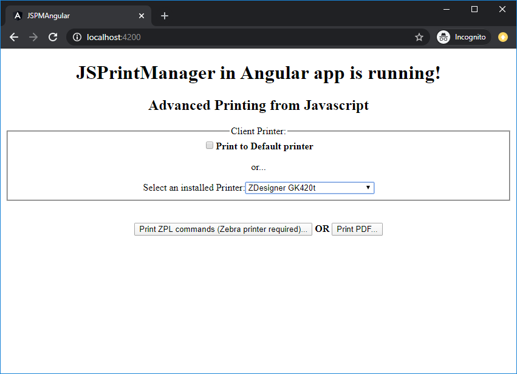

# JSPrintManager in Angular

This is a very simple **Angular 9** app using **[JSPrintManager](https://www.neodynamic.com/products/printing/js-print-manager)** to print raw printer commands and PDF files.
For additional samples **in plain Javascript code** for other printer commands and document file formats please refer to https://www.neodynamic.com/products/printing/js-print-manager/articles

## How to integrate JSPrintManager in Angular  
 
- Add all the JSPrintManager's Javascript + Typing files and its dependencies under `/src/assets/js/`. JSPrintManager files available at https://github.com/neodynamic/JSPrintManager/blob/master/scripts/ After doing that, it should look like the following: 
	- `./src/assets/js/JSPrintManager.js`
	- `./src/assets/js/JSPrintManager.d.ts`
- Add scripts references to `./angular.json` (Line 30 in this sample app)
- Add a reference to FormsModule in `./src/app/app.module.ts` (Lines 3 & 15 in this sample app)
- HTML for this sample `./src/app/app.component.html`
- JSPrintManager Logic for this sample `./src/app/app.component.ts`

## Licensing

**JSPrintManager is a Commercial** product. Licensing model and prices are available [here](https://neodynamic.com/products/printing/js-print-manager/buy)

## Support

Tech questions are handled by [Neodynamic Dev Team](https://neodynamic/support)
